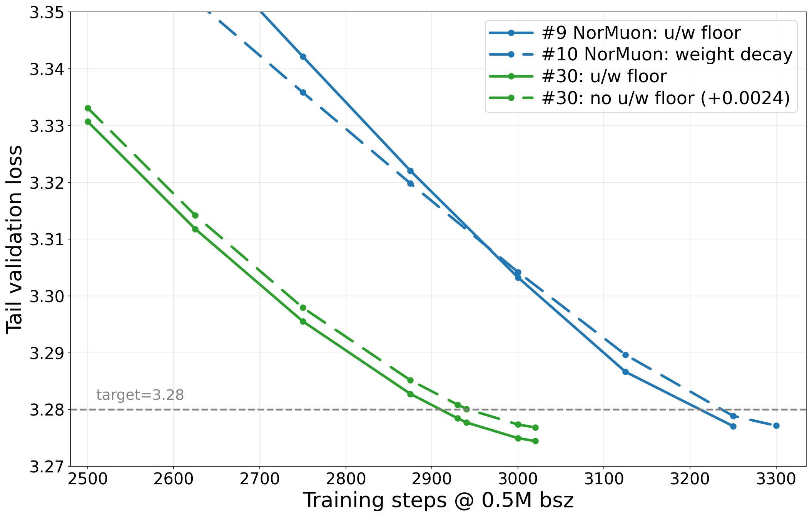
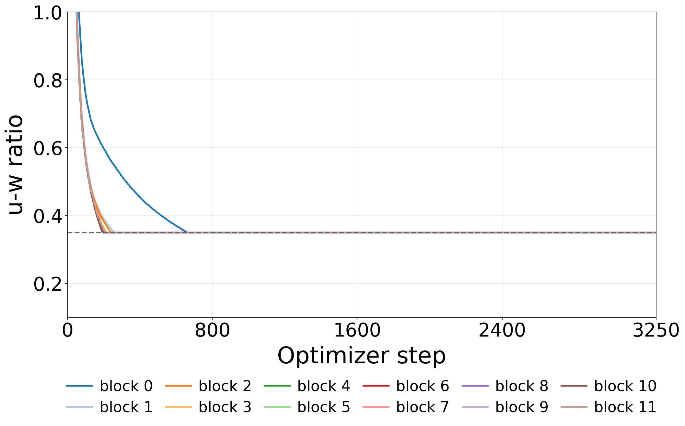
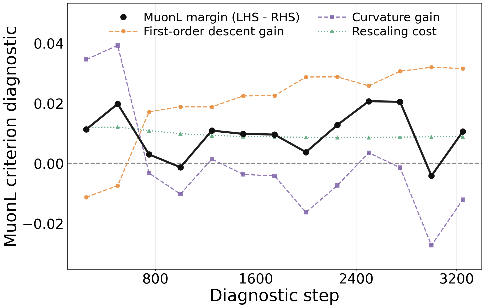
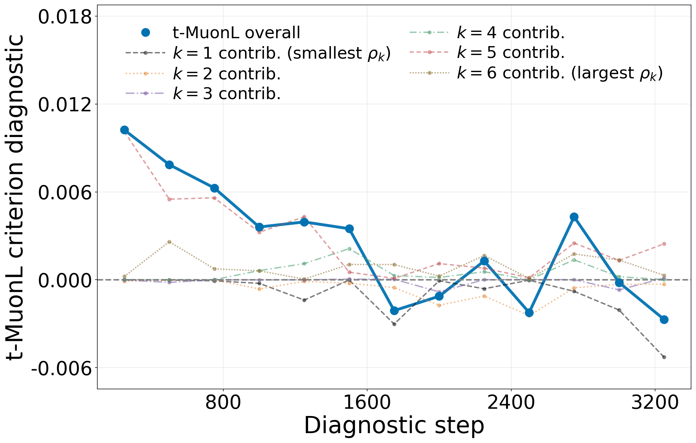
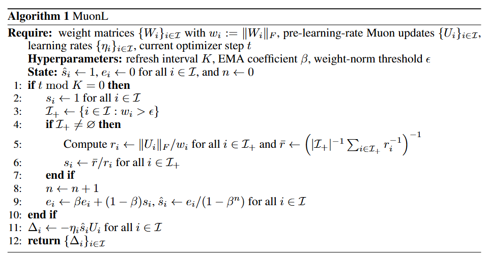
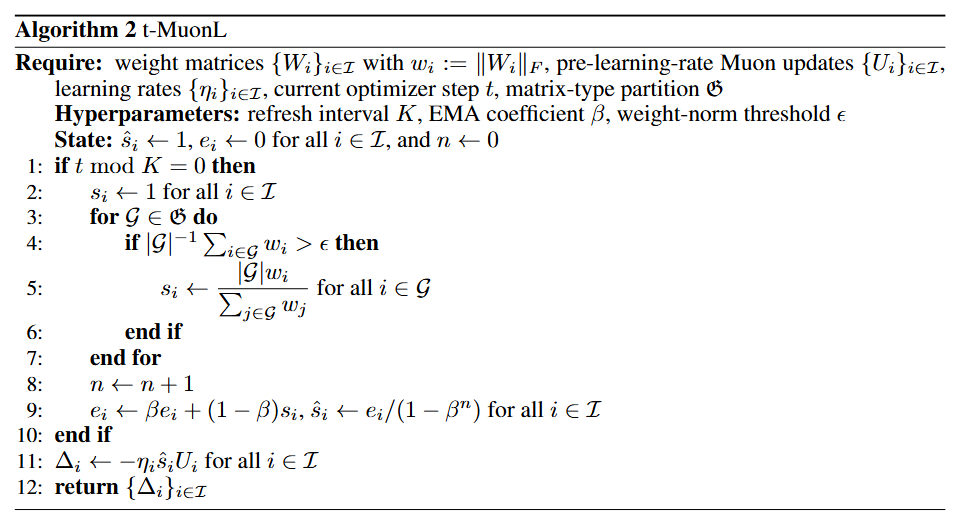
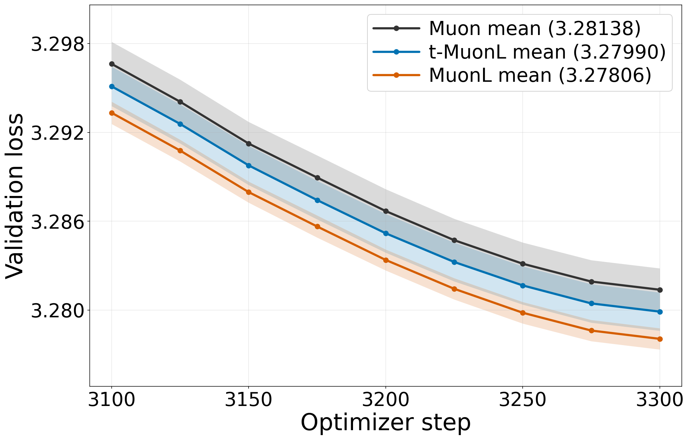
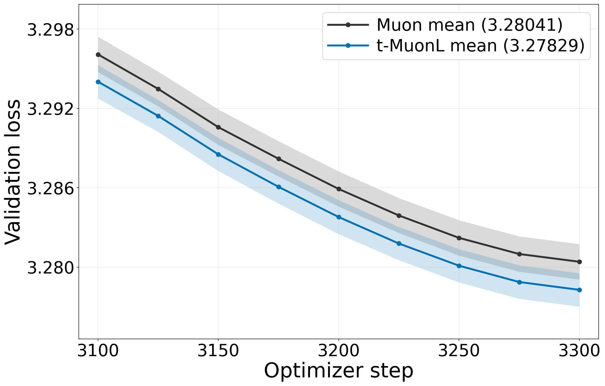

<h1 align="center">Does U-W Ratio Alignment Benefit Muon in LLM Pretraining?</h1>

<p align="center">
  <a href="uw_ratio_alignment.pdf"><b>Paper (PDF)</b></a> &nbsp;·&nbsp;
  <a href="#running-the-code"><b>Running the code</b></a> &nbsp;·&nbsp;
  <a href="Reproducibility.md"><b>Reproduction guide</b></a>
</p>

Most top entries in the modded-nanogpt optimization benchmark [[1]](#references), [[2]](#references) use a **u/w floor**. Besides keeping updates from becoming negligible [[3]](#references), the floor also aligns the update-to-weight (**u-w**) ratios of many weight blocks to one common value. This repository asks **when this u-w ratio alignment on its own helps Muon** [[4]](#references). It uses local diagnostics at checkpoints along Muon training to compare Muon with two alignment policies: **MuonL**, which gives every matrix one common ratio, and **t-MuonL**, which gives each matrix type its own common ratio.

**Contents:** [1 Motivation](#1-motivation-what-the-uw-floor-does) · [2 Setup](#2-setup) · [3 Diagnostics](#3-diagnostics-when-does-alignment-help) · [4 Algorithms and results](#4-algorithms-and-training-results) · [Running the code](#running-the-code)

---

## 1. Motivation: what the u/w floor does

<table>
  <tr>
    <td width="50%" valign="top"></td>
    <td width="50%" valign="top"></td>
  </tr>
  <tr>
    <td valign="top"><b>(a) Benchmark comparison.</b> Late-training validation loss for two comparisons from the modded-nanogpt optimization benchmark, with the u/w floor (solid) and without it (dashed): NorMuon <a href="#references">[5]</a> in blue and Aurora <a href="#references">[6]</a> in green. The earlier a curve crosses the target line at 3.28, the fewer steps it needs. Legend numbers are benchmark entry IDs.</td>
    <td valign="top"><b>(b) U-W ratios under the u/w floor.</b> u-w ratios of the 12 attention output projections W<sub>O</sub>, one curve per layer, in a NorMuon run with the u/w floor. The dashed line is the floor threshold c = 0.35. All curves drop to it early and stay there.</td>
  </tr>
</table>

The modded-nanogpt optimization benchmark (Track 3) [[1]](#references) fixes the architecture, data, and batch size, and ranks optimizers by how many training steps they need to reach validation loss 3.28. As (a) shows, runs with the u/w floor reach the target in about **0.8–1.1% fewer steps**.

For a weight matrix $`W_i`$ with Muon update $`U_i`$ (before the learning rate), the **u-w ratio** is $`r_i=\lVert U_i\rVert_F/\lVert W_i\rVert_F`$. Whenever $`r_i`$ falls below a threshold $`c`$, the u/w floor rescales $`U_i`$ back up to it. Every block uses the same $`c`$, so all blocks that reach the floor end up with **the same ratio**, as in (b). Decoupled weight decay [[7]](#references) also keeps updates from becoming negligible relative to the weights, but it does not force this equality at every step.

> [!NOTE]
> **Research question.** Is this alignment part of why the u/w floor helps? To find out, we remove the floor, keep decoupled weight decay, and impose the alignment directly on Muon's updates.

---

## 2. Setup

**Update model.** $`ℐ`$ indexes the matrices that Muon updates: 72 in the 12-layer model. For block $`i\inℐ`$:

- $`W_i`$ is the weight and $`w_i=\lVert W_i\rVert_F`$ its norm.
- $`U_i`$ is the Muon update, $`\eta_i`$ its learning rate, and $`r_i`$ the original u-w ratio.
- $`V_i=U_i/\lVert U_i\rVert_F`$ is the unit update direction.

An alignment policy keeps every direction $`V_i`$ **fixed** and only replaces $`r_i`$ with an assigned ratio $`x_i`$:

```math
\Delta_i(x) := -\,\eta_i\, x_i\, \lVert W_i\rVert_F\, V_i \qquad\text{(1)}
```

So policies differ only in $`x=(x_i)_{i\inℐ}`$. Setting $`x_i=r_i`$ gives back Muon.

**Matrix types.** Each type contains the 12 same-shaped matrices that play one role across the 12 layers. The six types [[8]](#references) are the attention projections $`W_Q, W_K, W_V, W_O`$ and the MLP projections $`W_{\mathrm{up}}, W_{\mathrm{down}}`$. Two different symbols appear below:

| Symbol | Meaning |
| :-- | :-- |
| $`𝒢`$ | **One type**, e.g. the 12 $`W_O`$ matrices. $`𝒢(i)`$ is the type that contains block $`i`$; $`\lvert 𝒢\rvert`$ is the number of blocks in it. |
| $`𝔊=\{𝒢_1,\ldots,𝒢_N\}`$ | **The partition** of $`ℐ`$ into all $`N=6`$ types. |

**Three ratio policies.** Each alignment group is assigned the harmonic mean of its original ratios:

```math
x_i^{\mathrm{base}} = r_i,
\qquad
x_i^{\mathrm{typed}} = \Bigl(\frac{1}{\lvert 𝒢(i)\rvert}\sum_{j\in 𝒢(i)} r_j^{-1}\Bigr)^{-1},
\qquad
x_i^{\mathrm{full}} = \Bigl(\frac{1}{\lvert ℐ\rvert}\sum_{j\in ℐ} r_j^{-1}\Bigr)^{-1}
\qquad\text{(2)}
```

- **base = Muon:** no alignment.
- **typed = t-MuonL:** one common ratio within each type.
- **full = MuonL:** one common ratio across all blocks.

**Two learning-rate settings.**

- **Shared learning rate (SL):** $`\eta_i=\eta`$ for every block. We compare Muon, MuonL, and t-MuonL.
- **Type-specific learning rates (TL):** $`\eta_i=\eta_{𝒢(i)}`$, one rate per type, which can benefit LLM pretraining [[9]](#references), [[10]](#references). We compare Muon and t-MuonL only.

**Why t-MuonL.** The two motivations are:

1. **It adapts to type-specific learning rates.** The relative parameter change is $`\lVert\Delta_i\rVert_F/\lVert W_i\rVert_F=\eta_i x_i`$. If types use different learning rates, one ratio shared across types no longer gives aligned changes. One ratio *within* each type still does.
2. **It distorts Muon's shape scaling less.** Muon sets each update norm $`\lVert U_i\rVert_F`$ from the matrix's dimensions [[4]](#references), [[11]](#references). Aligning across types with different shapes distorts those norms. In NanoGPT [[12]](#references), all matrices within one type have the same shape.

**What the diagnostics measure: optimization potential $`𝒮`$.** At a fixed checkpoint, $`𝒮(x)`$ is the one-step loss decrease predicted by a local quadratic model of the training loss under policy $`x`$, with the learning rate chosen optimally. Larger $`𝒮`$ means more local optimization potential. It does not depend on any particular learning-rate value and is not a measured loss.

- $`𝒮_{\mathrm{SL}}`$ optimizes one shared learning rate.
- $`𝒮_{\mathrm{TL}}`$ optimizes one learning rate per type, so curvature across types also enters.

Weight decay is left out of both scores; training applies it separately.

---

## 3. Diagnostics: when does alignment help?

Both diagnostics are evaluated every 250 steps along a 3300-step Muon run, for **13 checkpoints**. At each checkpoint, all policies share the same weights, update directions, and data batch, so only the assigned ratios $`x`$ differ.

### Quantities used in the propositions

**Definition (weighted mean, normalization, covariance).** Let $`\pi=(\pi_i)`$ be probability weights over blocks, and let $`f=(f_i)`$ and $`h=(h_i)`$ be per-block values. Then

```math
\langle f\rangle_\pi=\sum_i\pi_if_i,
\qquad
[f_i]_\pi=\frac{f_i}{\langle f\rangle_\pi}
```

```math
\mathrm{cov}_\pi(f,h)=\langle fh\rangle_\pi-\langle f\rangle_\pi\langle h\rangle_\pi,
\qquad
\mathrm{var}_\pi(f)=\mathrm{cov}_\pi(f,f)
```

A subscript $`𝒢`$ in place of $`\pi`$ means uniform weights over the blocks of type $`𝒢`$. A subscript $`𝒢\timesℋ`$ means uniform weights over all pairs $`i\in𝒢,\ j\inℋ`$, including $`i=j`$ when $`𝒢=ℋ`$.

**Per block** (both propositions):

| Definition | Intuition |
| :-- | :-- |
| $`w_i=\lVert W_i\rVert_F`$, $`\ m_i`$ | Weight norm and row dimension of $`W_i`$ |
| $`a_i=\langle G_i,V_i\rangle_F`$ | How much the loss drops, to first order, along the update direction ($`G_i`$: gradient for $`W_i`$) |
| $`C_{ij}=\langle V_i,H_{ij}[V_j]\rangle_F`$ | Curvature between the update directions of blocks $`i`$ and $`j`$ ($`H_{ij}`$: Hessian block) |
| $`\widetilde{L}_i^{ℐ}=C_{ii}+\sum_{j\neq i}\frac{2r_jw_j}{w_i(r_i+r_j)}C_{ij}`$ | Block $`i`$'s own curvature plus its weighted interactions with the other blocks |
| $`\pi_i=m_i/\sum_{j\inℐ}m_j`$ | Block weights proportional to row dimension |

**Per type** (Proposition 2 only; bold symbols stack the entries over types $`𝒢,ℋ\in𝔊`$):

| Symbol | Definition | Intuition |
| :-: | :-- | :-- |
| $`𝐠`$ | $`g_{𝒢}=\langle a_i\rangle_{𝒢}`$ | Mean first-order decrease of each type |
| $`𝐊`$ | $`K_{𝒢,ℋ}=\langle C_{ij}\rangle_{𝒢\timesℋ}`$ | Mean curvature between two types |
| $`𝐃`$ | $`\mathrm{diag}(1+c_{𝒢_1},\ldots,1+c_{𝒢_N})`$, $`\ c_{𝒢}=\mathrm{cov}_{𝒢}([w_i]_{𝒢},[a_i]_{𝒢})`$ | $`c_{𝒢}>0`$ when the larger-norm blocks of a type also descend more |
| $`𝚪`$ | $`\Gamma_{𝒢,ℋ}=(c_{𝒢}+c_{ℋ}+c_{𝒢}c_{ℋ})K_{𝒢,ℋ}-\mathrm{cov}_{𝒢\timesℋ}([w_i]_{𝒢}[w_j]_{ℋ},C_{ij})`$ | How within-type alignment changes curvature |

### Proposition 1: MuonL vs. Muon under a shared learning rate

> [!IMPORTANT]
> **Proposition 1.** If
>
> ```math
> 2\,\mathrm{cov}_\pi\!\left(\left[\frac{w_i}{\sqrt{m_i}}\right]_\pi,\left[\frac{a_i}{\sqrt{m_i}}\right]_\pi\right)
> -\mathrm{cov}_\pi\!\left(\left[\frac{w_i}{\sqrt{m_i}}\right]_\pi^{2},\bigl[\widetilde{L}_i^{ℐ}\bigr]_\pi\right)
> >\mathrm{var}_\pi\!\left(\left[\frac{w_i}{\sqrt{m_i}}\right]_\pi\right)
> \qquad\text{(11)}
> ```
>
> then $`𝒮_{\mathrm{SL}}(x^{\mathrm{full}})>𝒮_{\mathrm{SL}}(x^{\mathrm{base}})`$: MuonL has higher optimization potential than Muon.

<p align="center"></p>

**Figure 2(b).** The black curve is the criterion margin, the left-hand side of Eq. (11) minus its right-hand side, at each checkpoint. The other curves are the three terms of Eq. (11): first-order descent gain (orange, first term), curvature gain (purple, second term), and rescaling cost (green, right-hand side). A margin above 0 means MuonL has higher optimization potential than Muon at that checkpoint. A margin at or below 0 means only that this sufficient condition fails; it does not show that Muon is better.

> **Result.** The margin is positive at **11 of 13 checkpoints**. At each of these checkpoints, the criterion certifies that MuonL has greater local optimization potential than Muon. So the advantage holds at most states along the training trajectory.

### Proposition 2: t-MuonL vs. Muon under type-specific learning rates

> [!IMPORTANT]
> **Proposition 2.** Let $`(\rho_k,𝐯_k)_{k=1}^{N}`$ be the generalized eigenpairs satisfying
>
> ```math
> 𝐃^{-1}𝚪𝐃^{-1}𝐯_k=\rho_k\,𝐊𝐯_k,
> \qquad
> 𝐯_k^{\top}𝐊𝐯_\ell=𝟏\{k=\ell\}
> ```
>
> Then
>
> ```math
> 𝒮_{\mathrm{TL}}(x^{\mathrm{typed}})>𝒮_{\mathrm{TL}}(x^{\mathrm{base}})
> \quad\Longleftrightarrow\quad
> \sum_{k=1}^{N}\frac{\rho_k}{1-\rho_k}\bigl(𝐯_k^{\top}𝐠\bigr)^{2}>0
> \qquad\text{(15)}
> ```
>
> t-MuonL has higher optimization potential than Muon exactly when the sum is positive.

<p align="center"></p>

**Figure 3(a).** The thick blue curve is the sum in Eq. (15). The thin lines are its six mode terms $`\frac{\rho_k}{1-\rho_k}(𝐯_k^{\top}𝐠)^2`$, ordered from $`k=1`$ (smallest $`\rho_k`$) to $`k=6`$ (largest). Values above 0 favor t-MuonL, and values below 0 favor Muon.

> **Result.** The criterion supports an **overall advantage for t-MuonL**: the substantial positive values early in training outweigh the smaller negative values later. This early advantage is driven mainly by the mode with the second-largest $`\rho_k`$ ($`k=5`$), owing to its large matched first-order decrease $`(𝐯_k^{\top}𝐠)^2`$.

---

## 4. Algorithms and training results

In training, both methods multiply each Muon update by an alignment scale $`s_i=x_i/r_i`$. The scale is refreshed every $`K=5`$ steps and smoothed with a bias-corrected moving average [[13]](#references) ($`\beta=0.9`$); the update then applies the smoothed scale $`\hat s_i`$ as $`\Delta_i=-\eta_i\hat s_iU_i`$. Muon, MuonL, and t-MuonL all use the same decoupled weight decay.

<p align="center"></p>

**MuonL uses full alignment.** $`\bar r`$ is the harmonic mean of the ratios over *all* Muon-updated matrices, so every block is rescaled to one common ratio. The idea is related to trust-ratio scaling in LARS [[14]](#references) and LAMB [[15]](#references); MuonL shares its core principle with OrScale (vision configuration) [[16]](#references), but the two algorithms differ.

<p align="center"></p>

**t-MuonL aligns within each type.** The harmonic mean is taken inside each type $`𝒢\in𝔊`$. All matrices in a type share Muon's ideal update norm, so the scale reduces to $`s_i=\lvert𝒢\rvert\, w_i/\sum_{j\in𝒢}w_j`$.

### Five-seed validation loss (Figure 5)

<table>
  <tr>
    <td width="50%" valign="top"></td>
    <td width="50%" valign="top"></td>
  </tr>
  <tr>
    <td valign="top"><b>(a) Shared learning rate:</b> Muon, t-MuonL, and MuonL.</td>
    <td valign="top"><b>(b) Type-specific learning rates:</b> Muon and t-MuonL.</td>
  </tr>
</table>

Each curve is the tail of the **mean validation loss over five random seeds**. Shaded bands show **one standard deviation** across seeds. Lower is better. The means at step 3300 are:

| Setting | Muon | t-MuonL | MuonL |
| :-- | --: | --: | --: |
| Shared learning rate | 3.28138 | 3.27990 | **3.27806** |
| Type-specific learning rates | 3.28041 | **3.27829** | — |

### Benchmark validation (Table 1)

We also tested MuonL against the statistical validation rule of the modded-nanogpt optimization benchmark [[1]](#references), using **15 non-cherry-picked trials** in the shared-learning-rate configuration. Let $`\bar L`$ be the mean validation loss over the trials at a given step. The step count is validated when

```math
(3.28-\bar L)\sqrt{15}\ \ge\ 0.004
```

| Validation step | $`\bar L`$ | $`(3.28-\bar L)\sqrt{15}`$ | $`\ge 0.004`$? |
| :-: | :-: | :-: | :-: |
| 3250 | 3.27943 | 0.00222 | No |
| **3260** | **3.27889** | **0.00431** | **Yes** |
| 3270 | 3.27844 | 0.00603 | Yes |
| 3280 | 3.27805 | 0.00755 | Yes |

MuonL first meets the rule at **step 3260**. The corresponding Muon baseline (benchmark entry #12) first meets it at **step 3325**, so MuonL needs **65 fewer steps**. This counts optimizer steps to the validated target, not wall-clock time.

---

## Running the code

```bash
python -m pip install -r requirements.txt
python -m pip install -e .

# Regenerate a figure from the bundled logs (CPU is enough)
python scripts/plot_figures/shared_lr_random5_loss.py

# Print the resolved training command for one experiment
# (add --execute to train; needs CUDA and FineWeb shards)
python scripts/run_paper_experiment.py --config configs/random5_shared_lr_muonl.json
```

[Reproducibility.md](Reproducibility.md) has the full list of commands, the environment, and the one-command reproduction scripts. [configs/manifest.json](configs/manifest.json) maps each reported result to its configs, raw runs, scripts, and figures.

## Repository structure

```text
configs/             experiment definitions for all reported results (+ manifest.json)
src/                 model, Muon / MuonL / t-MuonL optimizer, training loop, local diagnostics
scripts/             training entry point, config runner, reproduction, analysis, and plotting scripts
experiment_results/  raw logs of our runs, incl. the 15-trial benchmark validation
external_results/    benchmark entries used only as comparison baselines (Figure 1a)
figures/             figures shown in this README
```

---

## References

1. Keller Jordan. *Modded-NanoGPT optimization benchmark (Track 3)*, 2026. [GitHub](https://github.com/KellerJordan/modded-nanogpt/tree/5bc4417e842cafac758c5dc276abd9beb7f32612/records/track_3_optimization) (snapshot accessed September 1, 2026).
2. Keller Jordan, Jeremy Bernstein, Brendan Rappazzo, @fernbear.bsky.social, Boza Vlado, You Jiacheng, Franz Cesista, Braden Koszarsky, and @Grad62304977. *Modded-NanoGPT: Speedrunning the NanoGPT baseline*, 2024. [GitHub](https://github.com/KellerJordan/modded-nanogpt)
3. Xiang Li, Shuo Chen, and Jian Yang. Understanding the disharmony between weight normalization family and weight decay. *AAAI*, 2020.
4. Keller Jordan, Yuchen Jin, Vlado Boza, Jiacheng You, Franz Cesista, Laker Newhouse, and Jeremy Bernstein. *Muon: An optimizer for hidden layers in neural networks*, 2024. [Blog post](https://kellerjordan.github.io/posts/muon/)
5. Zichong Li, Liming Liu, Chen Liang, Weizhu Chen, and Tuo Zhao. NorMuon: Making Muon more efficient and scalable. *ICML*, 2026.
6. Alec Dewulf, Dhruv Pai, Li Yang, Ashley Zhang, and Ben Keigwin. Aurora: A leverage-aware spectral optimizer. [arXiv:2606.27715](https://arxiv.org/abs/2606.27715), 2026.
7. Ilya Loshchilov and Frank Hutter. Decoupled weight decay regularization. *ICLR*, 2019.
8. Ashish Vaswani, Noam Shazeer, Niki Parmar, Jakob Uszkoreit, Llion Jones, Aidan N. Gomez, Łukasz Kaiser, and Illia Polosukhin. Attention is all you need. *NeurIPS*, 2017.
9. Jinbo Wang, Mingze Wang, Zhanpeng Zhou, Junchi Yan, Weinan E, and Lei Wu. The sharpness disparity principle in transformers for accelerating language model pre-training. *ICML*, 2025.
10. Ziqing Wen, Zhouyang Liu, Jiahuan Wang, Ping Luo, Li Shen, Dongsheng Li, and Tao Sun. Revealing modular gradient noise imbalance in LLMs: Calibrating Adam via signal-to-noise ratio. [arXiv:2605.05794](https://arxiv.org/abs/2605.05794), 2026.
11. Jeremy Bernstein and Laker Newhouse. Modular duality in deep learning. [arXiv:2410.21265](https://arxiv.org/abs/2410.21265), 2024.
12. Andrej Karpathy. *nanoGPT*, 2022. [GitHub](https://github.com/karpathy/nanoGPT)
13. Diederik P. Kingma and Jimmy Ba. Adam: A method for stochastic optimization. *ICLR*, 2015.
14. Yang You, Igor Gitman, and Boris Ginsburg. Large batch training of convolutional networks. [arXiv:1708.03888](https://arxiv.org/abs/1708.03888), 2017.
15. Yang You, Jing Li, Sashank Reddi, Jonathan Hseu, Sanjiv Kumar, Srinadh Bhojanapalli, Xiaodan Song, James Demmel, Kurt Keutzer, and Cho-Jui Hsieh. Large batch optimization for deep learning: Training BERT in 76 minutes. *ICLR*, 2020.
16. Yuxuan Lou and Yang You. OrScale: Orthogonalized optimization with layer-wise trust-ratio scaling. [arXiv:2605.07815](https://arxiv.org/abs/2605.07815), 2026.
